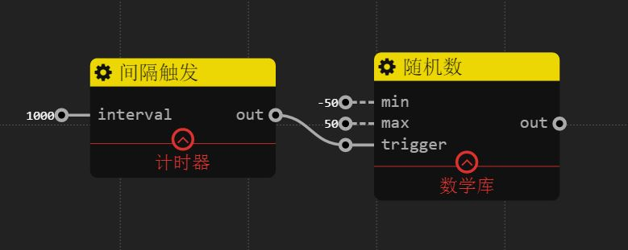

数学库
================
## 加法

### 描述

`out` = `in1` + `in2`

### 输入

`in1`: 数值类型

`in2`: 数值类型

### 输出

`out`: 数值类型 `out` = `in1` + `in2`

### 样例

`in1`:2.5

`in2`:-1

`out`输出1.5： 2.5 + (-1) = 1.5

## 减法

### 描述

`out` = `in1` - `in2`

### 输入

`in1`: 数值类型 被减数

`in2`: 数值类型 减数

### 输出

`out`: 数值类型 `out` = `in1` - `in2`

### 样例

`in1`:-2

`in2`:1.5

`out`输出-3.5： (-2) - 1.5 = (-3.5)

## 乘法

### 描述

`out` = `in1` x `in2`

### 输入

`in1`: 数值类型

`in2`: 数值类型

### 输出

`out`: 数值类型 `out` = `in1` x `in2`

### 样例

`in1`:-2

`in2`:-1.1

`out`输出2.2： (-2) x (-1.1) = 2.2

## 除法

### 描述

`out` = `in1` / `in2`

### 输入

`in1`: 数值类型 被除数

`in2`: 数值类型 除数

### 输出

`out`: 数值类型 `out` = `in1` / `in2`

### 样例

`in1`:1

`in2`:4

`out`输出0.25： 1 / 4 = 0.25

## 线性映射

### 描述

此服务将一个数值从一个区间线性映射到另一个区间。

### Config

`fromLow`: 数值类型. 源区间下限。

`fromHigh`: 数值类型. 源区间上限。

`toLow`: 数值类型. 目的区间下限。

`toHigh`: 数值类型. 目的区间上限。

### 输入

`in`: 数值类型，输入参数。

### 输出

`out`: 数值类型，输出值。

## 取整

### 描述

把一个数字舍入为最接近的整数。

### 输入

`in`: 数值类型，输入参数。

### 输出

`out`: 数值类型，输出值。

### 样例

`in`: 0.5

`out` 输出 1

`in`: 2.4

`out` 输出 2

## 随机数

### 描述

生成指定闭区间内的随机数。

### 输入

`min`: 数值类型，随机数区间下限。

`max`: 数值类型，随机数区间下限。

`trigger`: 任意类型，用以触发一次随机数生成。

### 输出

`out`: 数值类型，随机数。

### 样例

周期性输出闭区间\[-50, 50\]之间的随机数。

