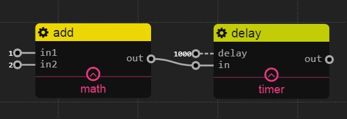
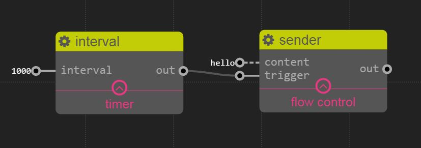

Timer
================
## delay

### Description

Whenever `in` receives a value, the value will be pass to `out` after `delay` milliseconds.

### Inport

`delay`: Integer. Default is 1000, *Non-trigger* inport. The time delay.

`in`: Any.

### Outport

`out`: Any. The value from `in` after delay.

### Example

For this example, if the add operation finished, 3 will be output after 1 second delay.

## interval

### Description

This service can be used as event source, which periodically output 1 to `out`.

### Inport

`in`: Integer. Default is 1000. The period of time.

### Outport

`out`: Integer. At this stage, the output value is fixed to Integer 1

### Example

After each 1 second, `out` will output a "hello" string.
